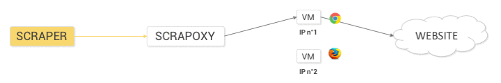

========
Scrapoxy
========

What is Scrapoxy ?
==================

http://scrapoxy.io

Scrapoxy **hides** your scraper behind a cloud.

It starts a pool of proxies to send your requests.

Now, you can crawl without thinking about blacklisting!

It is written in Javascript (ES6) with `Node.js`_ & AngularJS_ and it is **open source**!

How does Scrapoxy work ?
------------------------

1. When Scrapoxy starts, it creates and manages a pool of proxies.
2. Your scraper uses Scrapoxy as a normal proxy.
3. Scrapoxy routes all requests through a pool of proxies.

What Scrapoxy does ?
--------------------

- Create your own proxies
- Use multiple cloud providers (AWS_, DigitalOcean_, OVH_, Vscale_)
- Rotate IP addresses
- Impersonate known browsers
- Exclude blacklisted instances
- Monitor the requests
- Detect bottleneck
- Optimize the scraping

Why Scrapoxy doesn't support anti-blacklisting ?
------------------------------------------------

Anti-blacklisting is a job for the scraper.

When the scraper detects blacklisting, it asks Scrapoxy to remove the proxy from the proxies pool (through a REST API).

What is the best scraper framework to use with Scrapoxy ?
---------------------------------------------------------

You could use the open source `Scrapy framework`_ (Python_).

Does Scrapoxy have a SaaS mode or a support plan ?
--------------------------------------------------

Scrapoxy is an open source tool. Source code is highly maintained.
You are very welcome to `open an issue`_ for features or bugs.

If you are looking for a commercial product in SaaS mode or with a support plan,
we recommend you to check the `ScrapingHub`_ products
(`ScrapingHub`_ is the company which maintains the `Scrapy framework`_).

Documentation
=============

You can begin with the :doc:`quick_start/index` or look at the :doc:`changelog`.

Now, you can continue with :ref:`standard-docs`, and become an expert with :ref:`advanced-docs`.

And complete with :ref:`tutorials-docs`.

.. toctree::
   :maxdepth: 1
   :caption: Get Started

   quick_start/index
   changelog
   Licence <license>

.. _standard-docs:

.. toctree::
   :maxdepth: 1
   :caption: Standard

   standard/config/index
   standard/providers/awsec2/index
   standard/providers/digitalocean/index
   standard/providers/ovhcloud/index
   standard/providers/vscale/index
   standard/gui/index

.. _advanced-docs:

.. toctree::
   :maxdepth: 1
   :caption: Advanced

   advanced/understand/index
   advanced/api/index
   advanced/security/index
   advanced/startup/index

.. _tutorials-docs:

.. toctree::
   :maxdepth: 1
   :caption: Tutorials

   tutorials/python-scrapy/index
   tutorials/nodejs-request/index
   tutorials/python-scrapy-blacklisting/index

Prerequisite
============

- `Node.js`_ minimum version: 8.0.0

Contribute
==========

You can `open an issue`_ on this repository for any feedback (bug, question, request, pull request, etc.).

License
=======

See the :doc:`License <license>`.

**And don't forget to be POLITE when you write your scrapers!**

.. _AngularJS: https://angularjs.org/
.. _AWS: https://aws.amazon.com
.. _DigitalOcean: https://www.digitalocean.com
.. _`open an issue`: https://github.com/fabienvauchelles/scrapoxy/issues
.. _OVH: https://www.ovh.com
.. _`Node.js`: https://nodejs.org
.. _Python: https://www.python.org
.. _`ScrapingHub`: https://scrapinghub.com/
.. _`Scrapy framework`: http://scrapy.org
.. _Vscale: https://vscale.io
