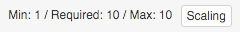
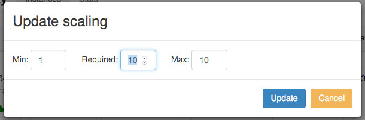
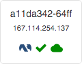
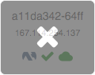
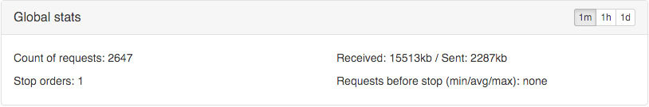
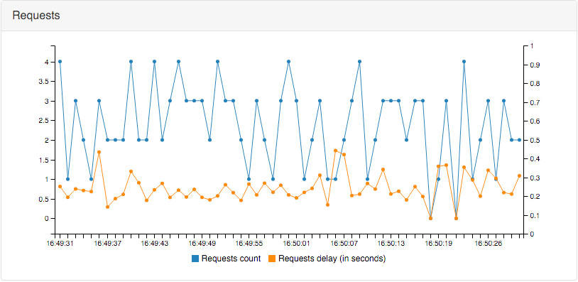
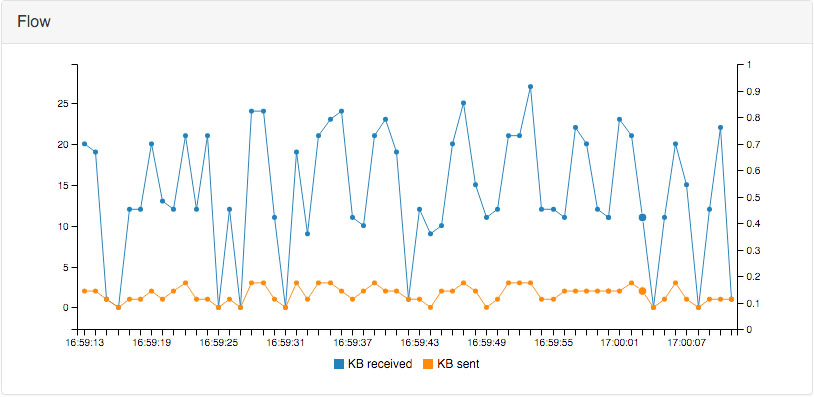

==========================
Manage Scrapoxy with a GUI
==========================

Connect
=======

You can access to the GUI at http://localhost:8889/

Login
=====

Enter your password.

The password is defined in the configuration file, key **commander.password**.

Dashboard
=========

.. image:: gui_general.jpg

Scrapoxy GUI has many pages:

- **Instances**. This page contains the list of instances managed by Scrapoxy;
- **Stats**. This page contains statistics on the use of Scrapoxy.

To login page redirects to the Instances page.

Page: Instances
===============

Scaling
-------

This panel shows the number of instances.

Scrapoxy has 3 settings:

- **Min**. The desired count of instances when Scrapoxy is asleep;
- **Max**. The desired count of instances when Scrapoxy is awake;
- **Required**. The count of actual instances.

To add or remove an instance, click on the **Scaling** button and change the **Required** setting:

Status of an instance
---------------------

Each instance is described in a panel.

This panel contains many information:

- Name of the instance;
- IP of the instance;
- Provider type;
- Instance status on the provider;
- Instance status in Scrapoxy.

Scrapoxy relays requests to instances which are **started** and **alived** 
(|started| + |alive|).

Type of provider
~~~~~~~~~~~~~~~~

+------------+-----------+
| |awsec2|   | AWS / EC2 |
+------------+-----------+
| |ovhcloud| | OVH Cloud |
+------------+-----------+

.. |awsec2| image:: gui_instance_awsec2.png
   :width: 25px

Status in the provider
~~~~~~~~~~~~~~~~~~~~~~

+------------+----------+
| |starting| | Starting |
+------------+----------+
| |started|  | Started  |
+------------+----------+
| |stopping| | Stopping |
+------------+----------+
| |stopped|  | Stopped  |
+------------+----------+

Status in Scrapoxy
~~~~~~~~~~~~~~~~~~

+---------+-------+
| |alive| | Alive |
+---------+-------+
| |dead|  | Dead  |
+---------+-------+

Remove an instance
------------------

Click on the instance to delete it.

The instance stops and is replaced by another.

Page: Stats
===========

There are 3 panels in stats:

- **Global stats**. This panel contains global stats;
- **Requests**. This panel contains the count of requests;
- **Flow**. This panel contains the flow requests.

Global
------

This panel has 4 indicators:

- the total **count of requests** to monitor performance;
- the total **count of received and sent data** to control the volume of data;
- the total of **stop instance orders**, to monitor anti-blacklisting;
- the **count of requests received by an instance** (minimum, average, maximum) to check anti-blacklisting performance.

Requests
--------

This panel combines 2 statistics on 1 chart.

It measures:

- the **count of requests** per minute;
- the **average execution time** of a request (round trip), per minute.

Flow
----

This panel combines 2 statistics on 1 chart.

It measures:

- the flow **received** by Scrapoxy;
- the flow **sent** by Scrapoxy.

How to increase the number of requests per minute ?
---------------------------------------------------

You add new instances (or new scrapers).

Do you increase the number of requests par minute ?

- **Yes**: Perfect!
- **No**: You pay instances for nothing.

Do I overload the target website ?
----------------------------------

You add new instances (or new scrapers).

Did the time of response increase ?

- **Yes**: The target website is overloaded.
- **No**: Perfect!
