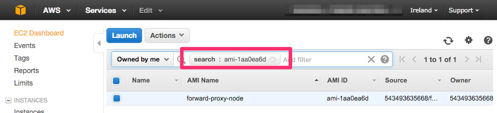
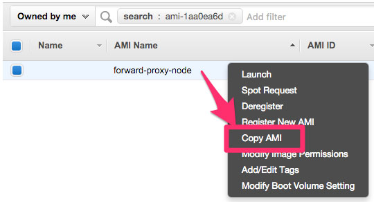
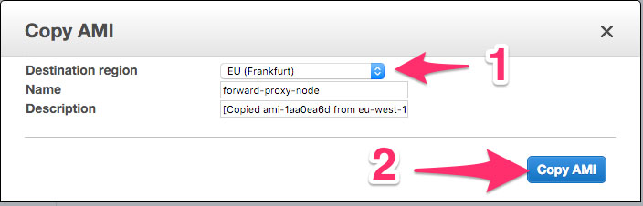
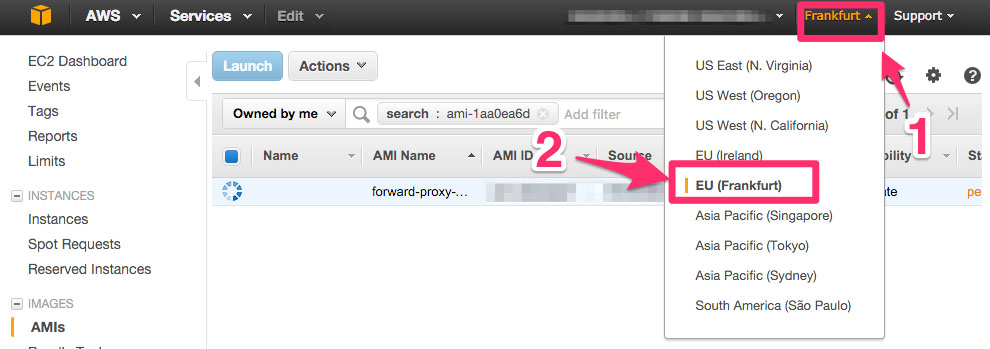

==========================================================
Tutorial: AWS / EC2 - Copy an AMI from a region to another
==========================================================

AMI (and security groups) are restricted to a region.

A AMI in eu-west-1 is not available in eu-central-1.

.. warning::
    You must create an AMI **by region**.

Step 1: Connect to your AWS console
===================================

Go to `AWS console`_.

Step 2: Connect to Ireland region
=================================

.. image:: ../change_region.jpg

Step 3: Go to EC2 dashboard
===========================
 
.. image:: ../create_security_group/step_1.jpg

Step 4: Find the public AMI
===========================
 
1. Click on *AMIs*
2. Search *ami-c74d0db4*

Step 5: Open copy AMI wizard
============================

1. Right click on instance
2. Click on *Copy AMI*

Step 6: Start AMI copy
======================

1. Choose the new destination region
2. Click on *Copy AMI*

Step 7: Connect to the new region
=================================

Step 8: Find the new AMI ID
===========================
 
The new AMI ID is in the column *AMI ID*.

.. image:: step_5.jpg

.. _`AWS console`: https://console.aws.amazon.com
