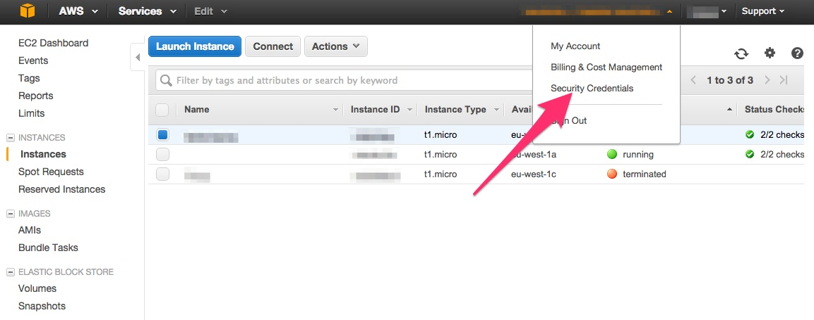
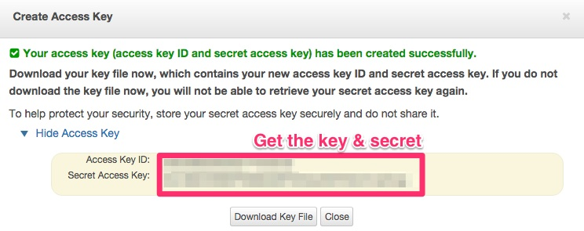

=====================================
Tutorial: AWS / EC2 - Get credentials
=====================================

Step 1: Connect to your AWS console
===================================

Go to `AWS console`_.

Step 2: Go to credentials
=========================
 

Step 3: Create a new key
========================
 
1. Click on *Access Key*
2. Click on *Create New Access Key*

.. image:: step_2.jpg

Step 4: Get the credentials
===========================
 
1. Click on *Show Access Key*
2. Get the values of *Access Key ID* and *Secret Access Key*

.. _`AWS console`: https://console.aws.amazon.com
