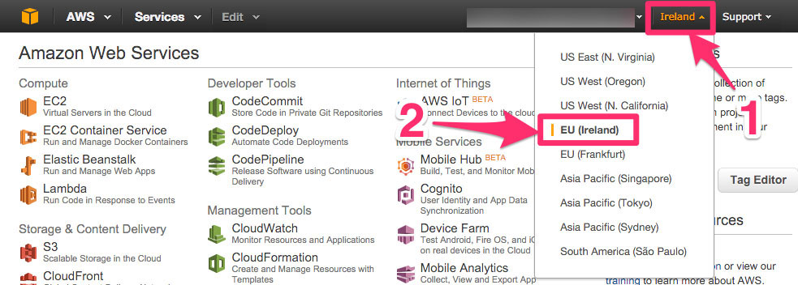

=========
AWS / EC2
=========

.. _`get-started`:

Get started
===========

Step 1: Get your AWS credentials
--------------------------------

See :doc:`Get credentials <get_credentials/index>`.

Remember your *Access Key* and *Secret Access Key*.

Step 2: Connect to your region
------------------------------

Step 3: Create a security group
-------------------------------
 
See :doc:`Create a security group <create_security_group/index>`.

Step 4: Choose an AMI
---------------------

Public AMI are available for theses regions:

- eu-west-1: ami-c74d0db4

If you cannot find your region, you can :doc:`Copy an AMI from a region to another <copy_ami_to_region/index>`.

Step 5: Update configuration
----------------------------

Open :code:`conf.json`::

  {
    "providers": {
      "type": "awsec2",

      "awsec2": {
        "region": "eu-west-1",
        "instance": {
          "InstanceType": "t1.micro",
          "ImageId": "ami-c74d0db4",
          "SecurityGroups": [ "forward-proxy" ],
        }
      }
    }
  }

And update *region* and *ImageId* with your parameters.

.. _configure-scrapoxy-awsec2:

Configure Scrapoxy
==================

Options: awsec2
---------------

For credentials, there is 2 choices:

1. Add credentials in the configuration file;
2. Or Use your own credentials (from profile, see the `AWS documentation`_).

=================== ============= ===================================================================================================================================
Option              Default value Description
=================== ============= ===================================================================================================================================
accessKeyId         none          Credentials for AWS (optional)
secretAccessKey     none          Credentials for AWS (optional)
region              none          AWS region (example: eu-west-1)
tag                 Proxy         Name of the AWS / EC2 instance
instance            none          see :ref:`awsec2 / instance <awsec2-instance>`
maxRunningInstances 10            It is a security limit. Scrapoxy cannot create new instances if the current count and the count of new instances exceeds this limit
=================== ============= ===================================================================================================================================

.. _awsec2-instance:

Options: awsec2 / instance
--------------------------

Options are specific to AWS / EC2.

Scrapoxy use the method `runInstances`_ to create new instances.

Standard options are *InstanceType*, *ImageId*, *KeyName*, and *SecurityGroups*.

Tutorials
=========

.. toctree::
   :maxdepth: 1

   Get AWS Credentials <get_credentials/index>
   Create a security group <create_security_group/index>
   Copy an AMI from a region to another <copy_ami_to_region/index>

.. _`AWS documentation`: http://docs.aws.amazon.com/AWSJavaScriptSDK/guide/node-configuring.html
.. _`runInstances`: http://docs.aws.amazon.com/AWSJavaScriptSDK/latest/AWS/EC2.html#runInstances-property

