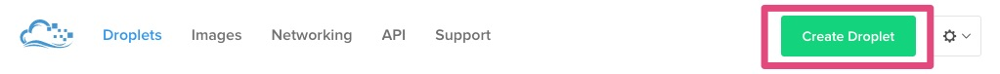
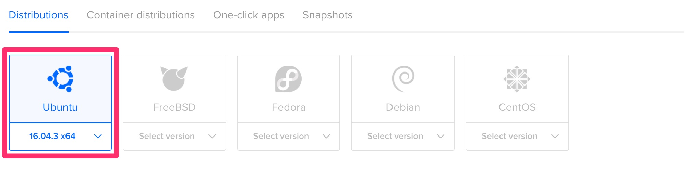
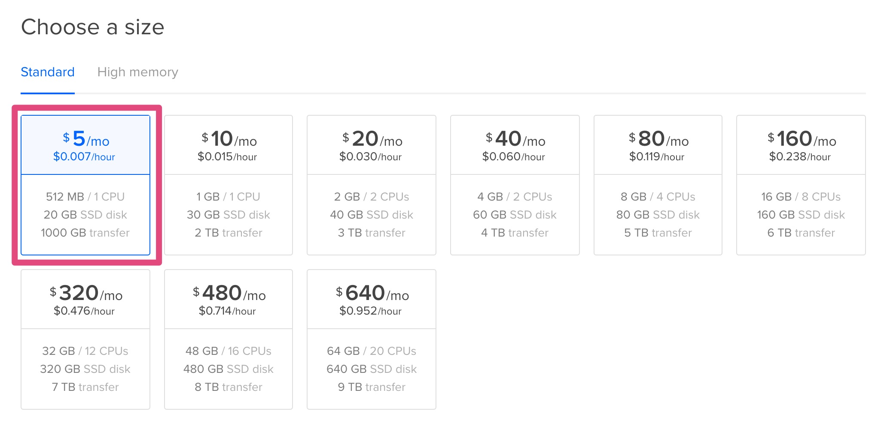
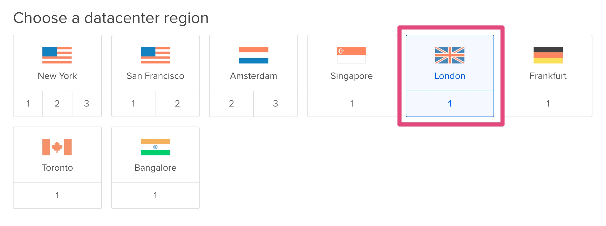
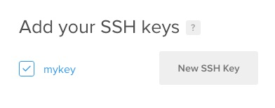
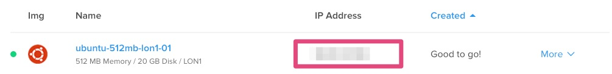
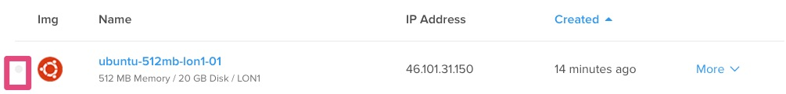
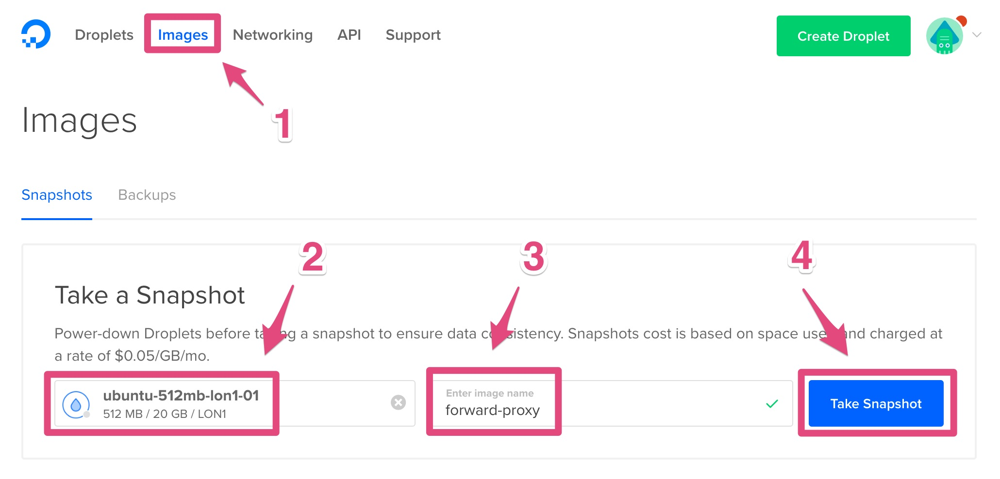
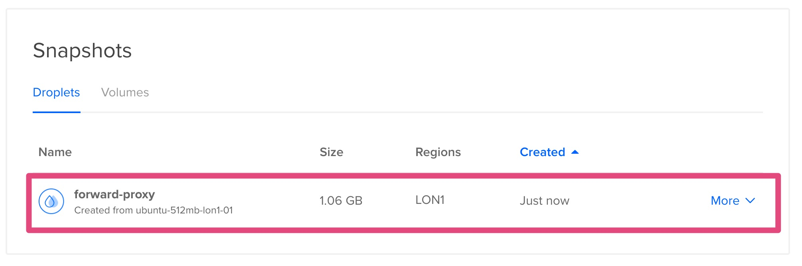

========================================
Tutorial: DigitalOcean - Create an image
========================================

Step 1: Connect to your DigitalOcean console
============================================

Go to `DigitalOcean console`_.

Step 2: Create a new droplet
============================

Click on *Create Droplet*

Step 3: Change the configuration of droplet
===========================================

Choose an image *Ubuntu 16.04.1 x64*:

Choose the smallest size:

Choose a datacenter (e.g.: London):

Use the SSH key named *mykey*:

Step 4: Start the droplet
=========================

Click on *Create*

.. image:: step_3.jpg

Step 5: Connect to the instance
===============================

Get the IP:

And enter this command in a terminal::

    ssh root@<replace by IP>

Step 6: Install the proxy
=========================

Install proxy with::

    curl --silent --location https://deb.nodesource.com/setup_8.x | sudo bash -
    sudo apt-get install --yes nodejs
    curl --silent --location https://raw.githubusercontent.com/fabienvauchelles/scrapoxy/master/tools/install/proxy.js | sudo tee /root/proxy.js > /dev/null
    curl --silent --location https://raw.githubusercontent.com/fabienvauchelles/scrapoxy/master/tools/install/proxyup.sh | sudo tee /etc/init.d/proxyup.sh > /dev/null
    sudo chmod a+x /etc/init.d/proxyup.sh
    sudo update-rc.d proxyup.sh defaults
    sudo /etc/init.d/proxyup.sh start

Step 7: Poweroff the droplet
============================

1. Stop the last command (CTRL-C)
2. Power off the droplet::

    sudo poweroff

The green icon disappears when the droplet is off:

Step 8: Create a backup
=======================

1. Click on *Images*
2. Select your droplet
3. Enter *forward-proxy* in *Image Name*
4. Click on *Take Snapshot*

Wait a few minutes and the new image appears:

.. _`DigitalOcean console`: https://cloud.digitalocean.com
