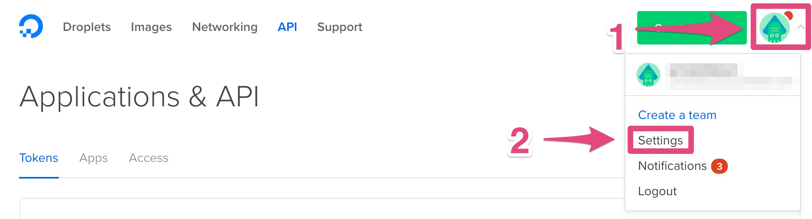
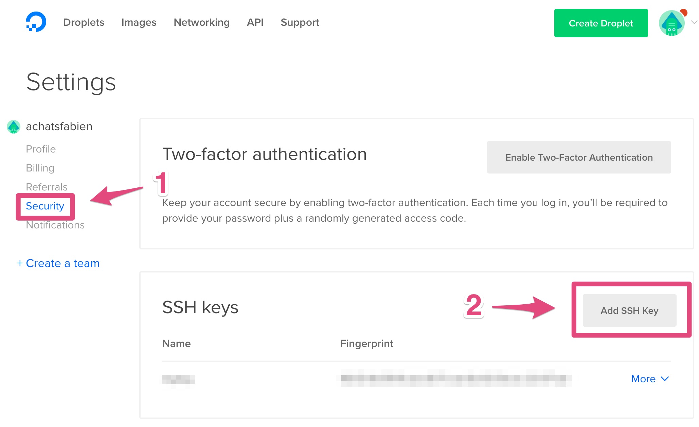
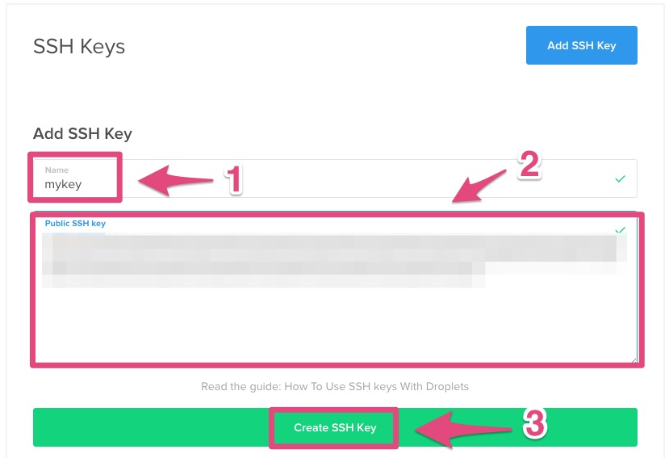

=========================================
Tutorial: DigitalOcean - Create a SSH key
=========================================

Step 1: Connect to your DigitalOcean console
============================================

Go to `DigitalOcean console`_.

Step 2: Go to settings
======================

1. Click on the top right icon
2. Click on *Settings*

Step 3: Add a new key
=====================

1. Click on *Security*
2. Click on *Add SSH Key*

Step 4: Create a new key
========================

1. Paste your SSH key
2. Enter *mykey* for the name
3. Click on *Add SSH Key*

You can generate your key with this `tutorial on Github`_.

And remember the **name of the key**!

.. _`DigitalOcean console`: https://cloud.digitalocean.com
.. _`tutorial on Github`: https://help.github.com/articles/generating-ssh-keys/
