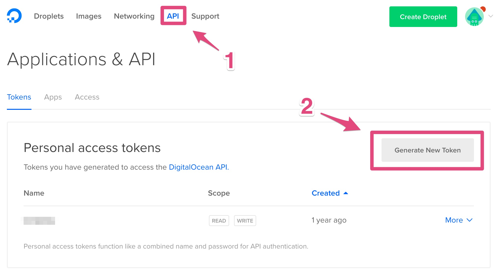
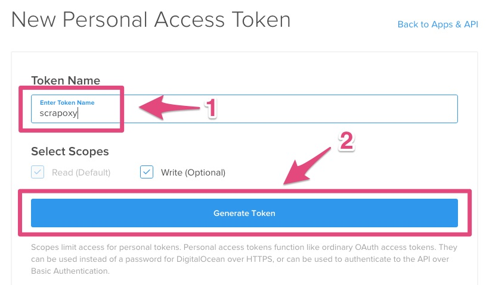
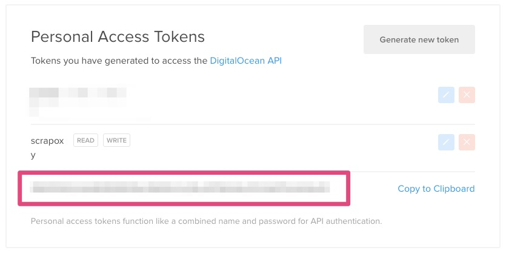

========================================
Tutorial: DigitalOcean - Get credentials
========================================

Step 1: Connect to your DigitalOcean console
============================================

Go to `DigitalOcean console`_.

Step 2: Generate a new token
============================

1. Click on *API*
2. Click on *Generate new token*

Step 3: Create a new token
==========================

1. Enter *scrapoxy* in *Token Name*
2. Click on *Generate Token*

Step 4: Get the credentials
===========================

Remember the *token*

.. _`DigitalOcean console`: https://cloud.digitalocean.com
