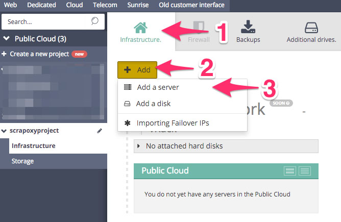
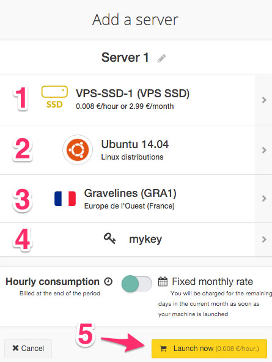
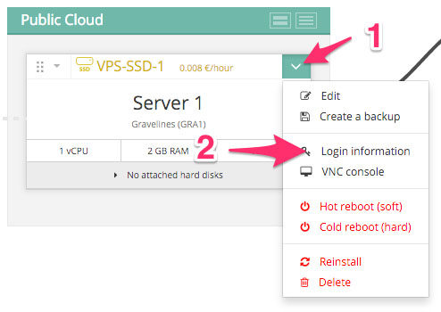
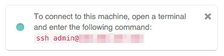
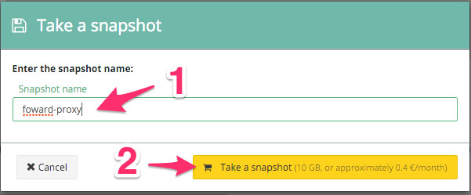

==========================================
Tutorial: OVH Cloud - Create a proxy image
==========================================

Step 1: Connect to your new project
===================================

Go to OVH dashboard and select your new project.

Step 2: Create a new server
===========================

1. Click on *Infrastructure*
2. Click on *Add*
3. Click on *Add a server*

Step 3: Change the configuration of server
==========================================

1. Change the type of server to *VPS-SSD-1* (cheapest)
2. Change the distribution to *Ubuntu*
3. Change region to *GRA1* (or another if you want)
4. Change the SSH key to *mykey*
5. Click on *Launch now*

Step 4: Get login information
=============================

When the instance is ready:

1. Click on the *v* on the top right corner
2. Click on *Login information*

Step 5: Connect to the instance
===============================

Remember the **SSH command**.

Step 6: Install the proxy
=========================

Connect to the instance and install proxy::

    sudo apt-get install curl
    curl --silent --location https://deb.nodesource.com/setup_8.x | sudo bash -
    sudo apt-get install --yes nodejs
    curl --silent --location https://raw.githubusercontent.com/fabienvauchelles/scrapoxy/master/tools/install/proxy.js | sudo tee /root/proxy.js > /dev/null
    curl --silent --location https://raw.githubusercontent.com/fabienvauchelles/scrapoxy/master/tools/install/proxyup.sh | sudo tee /etc/init.d/proxyup.sh > /dev/null
    sudo chmod a+x /etc/init.d/proxyup.sh
    sudo update-rc.d proxyup.sh defaults
    sudo /etc/init.d/proxyup.sh start

Step 7: Create a backup
=======================

Go back on the OVH project dashboard:

1. Click on the *v* on the top right corner
2. Click on *Create a backup*

.. image:: step_5.jpg

Step 8: Start the backup
========================

1. Enter the snapshot name *forward-proxy*
2. Click on *Take a snapshot*

You need to wait 10 minutes to 1 hour.

