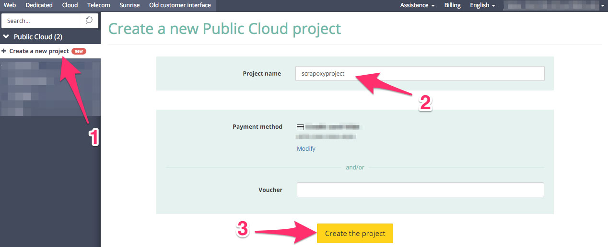
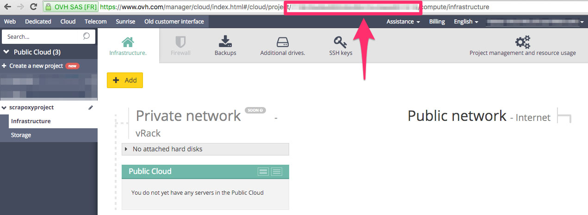

======================================
Tutorial: OVH Cloud - Create a project
======================================

Step 1: Connect to your OVH dashboard
=====================================

Go to `OVH Cloud`_.

Step 2: Create a new project
============================

1. Click on *Create a new project*
2. Fill project name
3. Click on *Create the project*

Step 3: Save serviceID
======================

Remember the ID in the URL: it is the project **serviceId**.

.. _`OVH Cloud`: https://www.ovh.com/manager/cloud/login/
