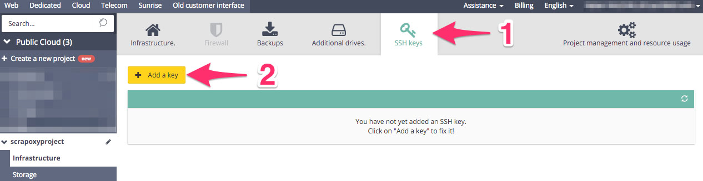
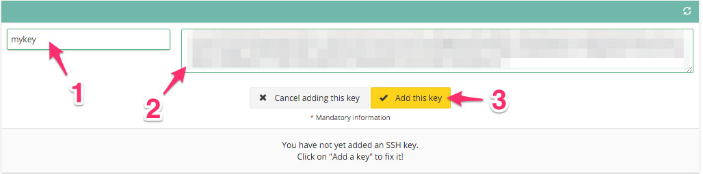

======================================
Tutorial: OVH Cloud - Create a SSH key
======================================

Step 1: Connect to your new project
===================================

Go to OVH dashboard and select your new project.

Step 2: Create a new key
========================

1. Click on the tab *SSH keys*
2. Click on *Add a key*

Step 3: Enter the key
=====================

1. Set the name of the key *mykey*
2. Copy your key
3. Click on *Add the key*

You can generate your key with this `tutorial on Github`_.

And remember the **name of the key**!

.. _`tutorial on Github`: https://help.github.com/articles/generating-ssh-keys/
