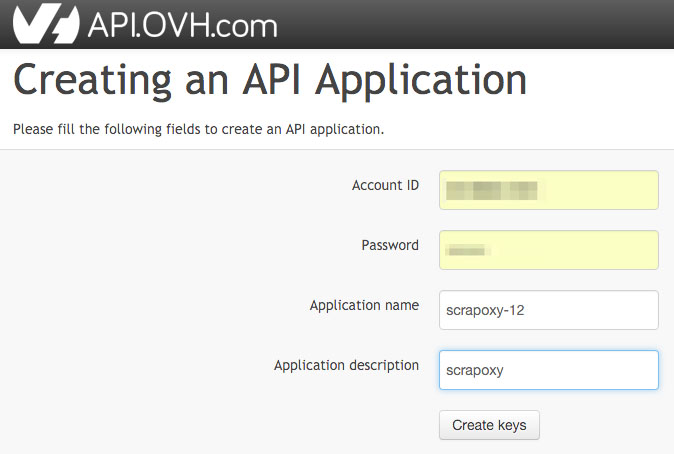
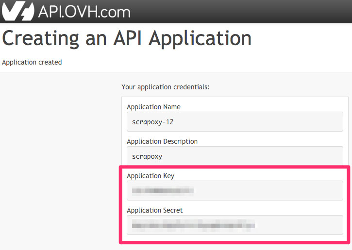
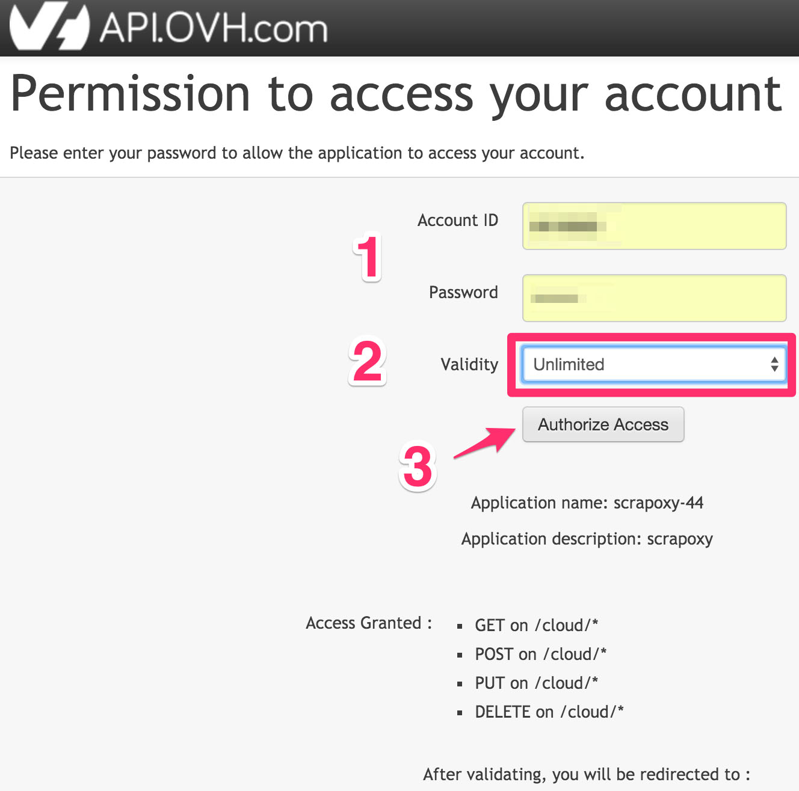

=====================================
Tutorial: OVH Cloud - Get credentials
=====================================

Step 1: Create an API Application
=================================

1. Go on https://eu.api.ovh.com/createApp/
2. Enter ID and password
3. Add a name name (e.g.: scrapoxy-12)
4. Add a description (e.g.: scrapoxy)
5. Click on *Create keys*

Step 2: Save application credentials
====================================

Remember *Application Key* and *Application Secret*:

Step 3: Get the consumerKey
===========================

Use Scrapoxy to get your key::

    scrapoxy ovh-consumerkey <endpoint> <Application Key> <Application Secret>

Endpoints are:

- **ovh-eu** for OVH Europe;
- **ovh-ca** for OVH North-America.

Remember *consumerKey* and click on *validation URL* to validate key.

Step 4: Add permission
======================

When you open validation URL:

1. Enter ID and password
2. Choose *Unlimited* validity
3. Click on *Authorize Access*

