==================================
Tutorial: Vscale - Create an image
==================================

Step 1: Connect to your Vscale console
======================================

Go to `Vscale console`_.

Step 2: Create a new scalet
===========================

1. Click on *SERVERS*
2. Click on *CREATE SERVER*

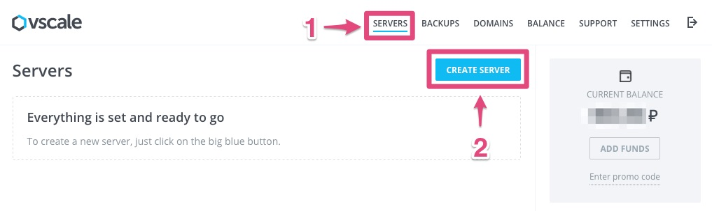

Step 3: Change the configuration of scalet
==========================================

Choose an image *Ubuntu 16.04 64bit*:

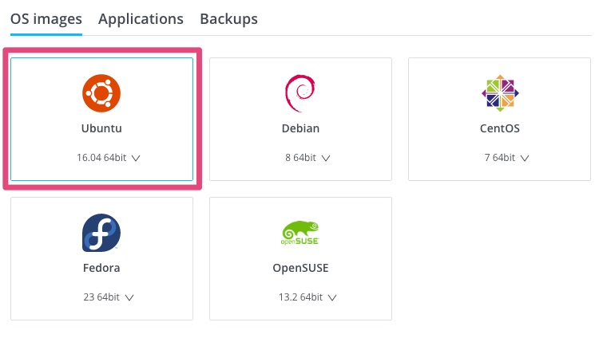

Choose the smallest configuration:

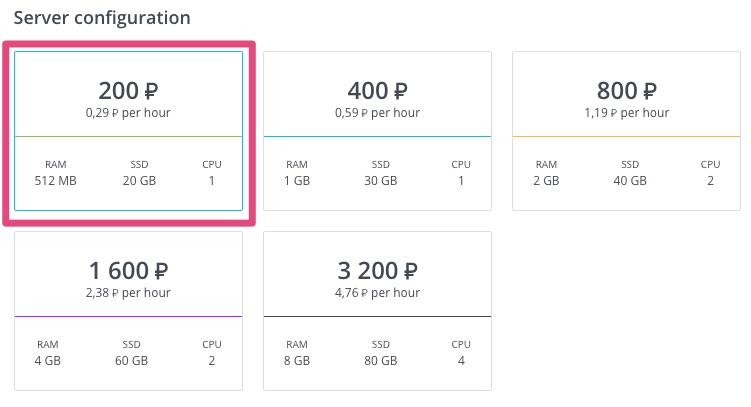

Choose a datacenter (e.g.: Moscow):

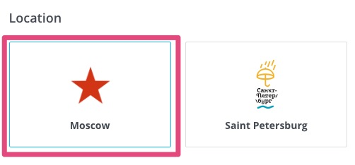

Use the SSH key named *mykey*:

.. image:: step_2d.jpg

Step 4: Create the scalet
=========================

Click on *CREATE SERVER*

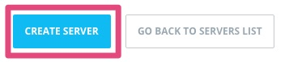

Step 5: Connect to the instance
===============================

Get the IP:

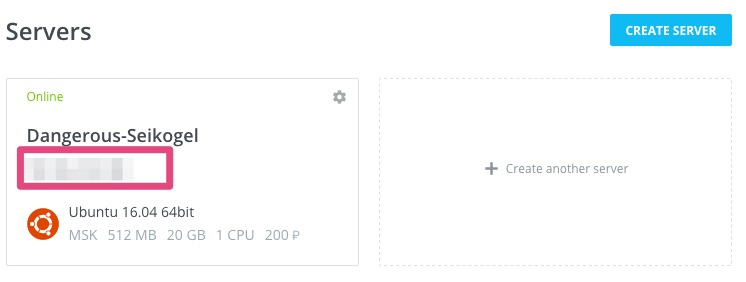

And enter this command in a terminal::

    ssh root@<replace by IP>

Step 6: Install the proxy
=========================

Install proxy with::

    sudo apt-get update
    sudo apt-get install --yes curl
    curl --silent --location https://deb.nodesource.com/setup_8.x | sudo bash -
    sudo apt-get install --yes nodejs
    curl --silent --location https://raw.githubusercontent.com/fabienvauchelles/scrapoxy/master/tools/install/proxy.js | sudo tee /root/proxy.js > /dev/null
    curl --silent --location https://raw.githubusercontent.com/fabienvauchelles/scrapoxy/master/tools/install/proxyup.sh | sudo tee /etc/init.d/proxyup.sh > /dev/null
    sudo chmod a+x /etc/init.d/proxyup.sh
    sudo update-rc.d proxyup.sh defaults
    sudo /etc/init.d/proxyup.sh start

Step 7: Poweroff the scalet
===========================

1. Stop the last command (CTRL-C)
2. Power off the scalet::

    sudo poweroff

The status is *Offline* when the scalet is off:

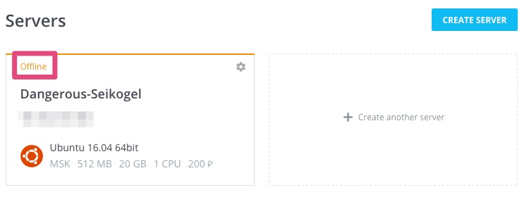

Step 8: Open the scalet
=======================

Click on the scalet:

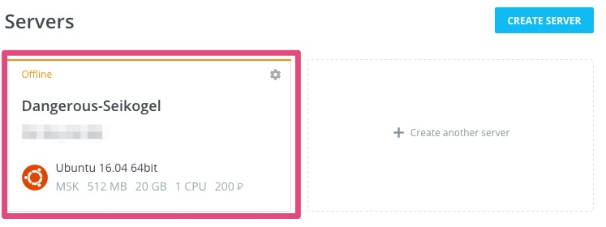

Step 9: Prepare backup
======================

Click on the scalet:

Click on *Create backup*

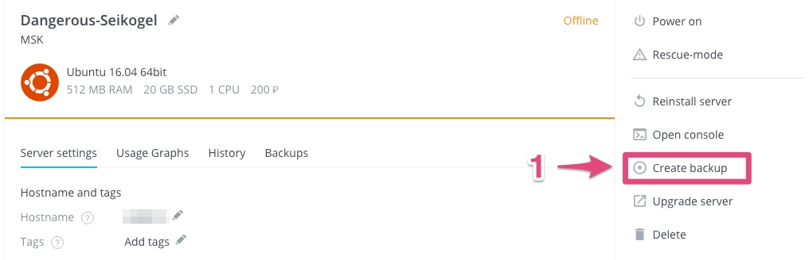

Step 10: Create backup
======================

3. Enter *forward-proxy* in *Name*
4. Click on *CREATE BACKUP*

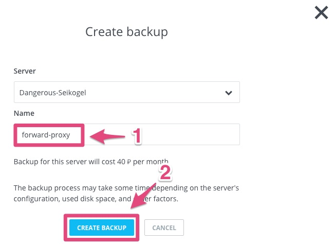

Wait a few minutes and the new image appears:

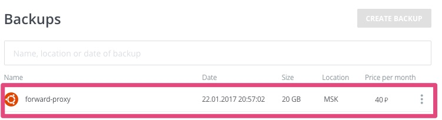

.. _`Vscale console`: https://vscale.io/panel
