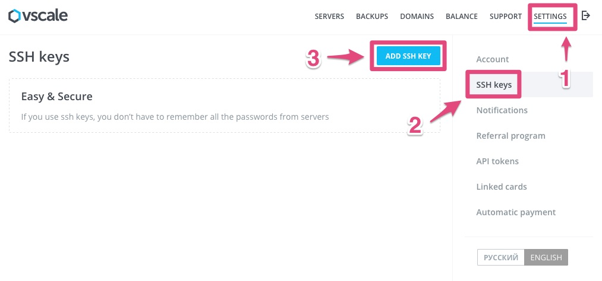
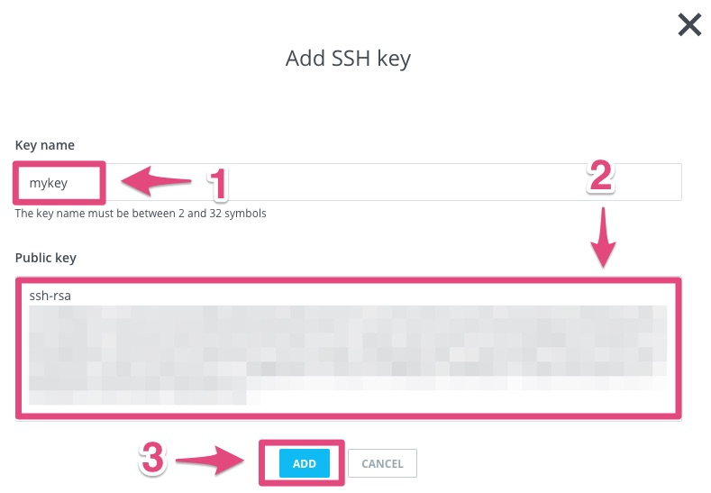

===================================
Tutorial: Vscale - Create a SSH key
===================================

Step 1: Connect to your Vscale console
======================================

Go to `Vscale console`_.

Step 2: Add a new key
=====================

1. Click on *SETTINGS*
2. Click on *SSH keys*
3. Click on *ADD SSH KEY*

Step 3: Create a new key
========================

1. Enter *mykey* for the name
2. Paste your SSH key
3. Click on *ADD*

You can generate your key with this `tutorial on Github`_.

And remember the **name of the key**!

.. _`Vscale console`: https://vscale.io/panel
.. _`tutorial on Github`: https://help.github.com/articles/generating-ssh-keys/
