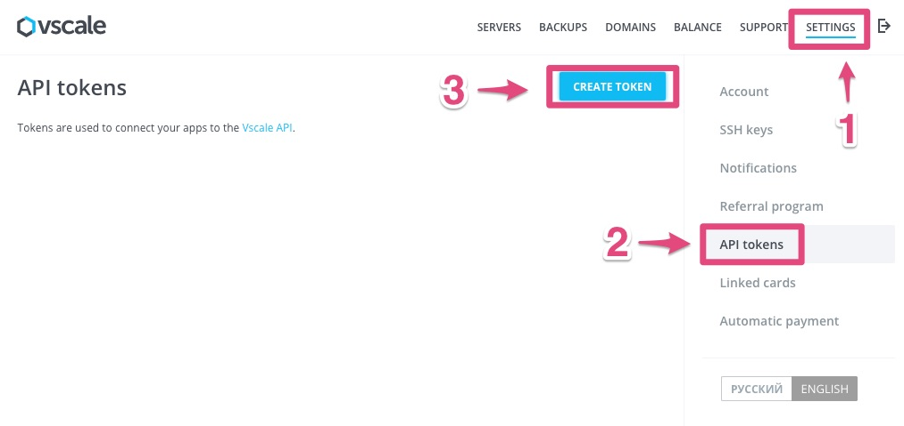
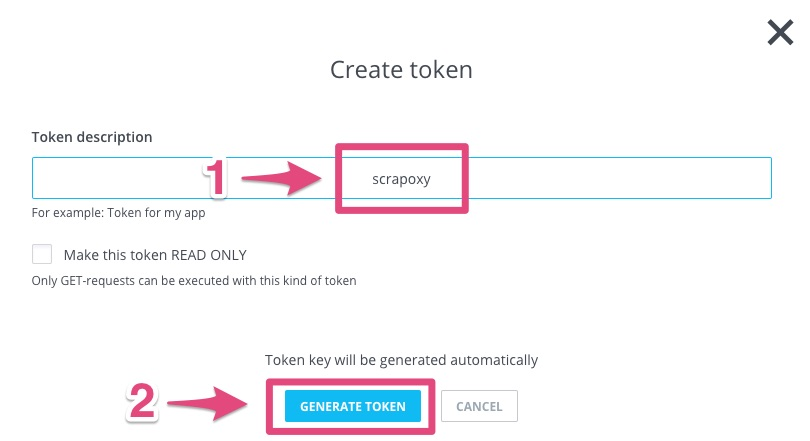
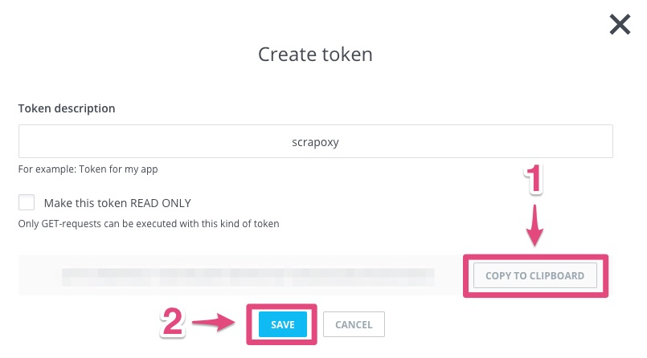

==================================
Tutorial: Vscale - Get credentials
==================================

Step 1: Connect to your Vscale console
======================================

Go to `Vscale console`_.

Step 2: Generate a new token
============================

1. Click on *SETTINGS*
2. Click on *API tokens*
3. Click on *CREATE TOKEN*

Step 3: Create a new token
==========================

1. Enter *scrapoxy* in *Token description*
2. Click on *GENERATE TOKEN*

Step 4: Get the credentials
===========================

1. Click on *COPY TO CLIPBOARD*
2. Click on *SAVE*

Remember the *token*

.. _`Vscale console`: https://vscale.io/panel
